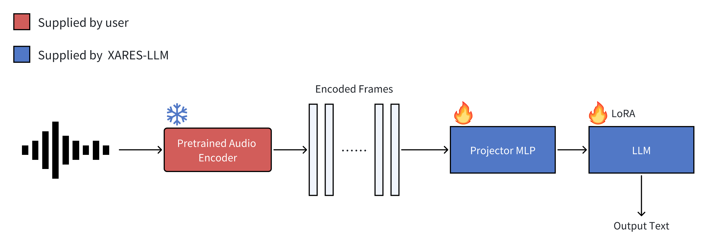

# XARES-LLM

XARES-LLM trains a typical LALM using the audio encoder provided by the user. 
The system automatically downloads training data, trains the LALM then tests various downstream tasks, providing scores for each. 



## Installation

```bash
uv venv 
uv pip install $THIS_REPO
```

## Usage


You can either pass a .py file with your encoder defined inside, requiring the ending "Encoder":

```bash
python3 -m xares_llm.run example/dummy/dummyencoder.py 
```

Or pass the module directly:

```bash
python3 -m xares_llm.run example.dummy.dummyencoder.DummyEncoder
```

### Task 1 ( Classification )


```bash
python3 -m xares_llm.run example/dummy/dummyencoder.py task1 task1
```

### Task 2 ( Understanding )

```bash
python3 -m xares_llm.run example/dummy/dummyencoder.py task2 task2
```


For reprodution purposes **Please run the script on one GPU!**.


### Encoder example


Any Encoder needs to be derived from `torch.nn.Module`, accepting `(audio, audio_attention_mask)` as input and outputs `(features, feature_attention_mask)` and a set variable `output_dim` that represents the model's embedding size.
Masks use the huggingface format, 1 represents keep, 0 represents mask and `feature_attention_mask.size(-1) == features.size(1)`

```python
class DummyEncoder(torch.nn.Module):
    def __init__(self, **kwargs) -> None:
        super().__init__()
        self.output_dim = 256

    def forward(self, audio, audio_attention_mask=None) -> tuple[torch.Tensor, torch.Tensor | None]:
        output = torch.randn(len(audio), 10, self.output_dim, device=audio.device)
        # Do something with attention mask or just return None, both are alright
        return output, audio_attention_mask
```

## Baseline results

### Task1


| Task | Dasheng-Base Score | Whisper-Base Score | 
| :--- | :---: | :---: |
| `eval_asvspoof2015` | 0.937 | 0.943 |
| `eval_cremad` | 0.621 | 0.516 |
| `eval_esc-50` | 0.755 | 0.635 |
| `eval_fluentspeechcommands` | 0.984 | 0.817 |
| `eval_freemusicarchive` | 0.429 | 0.579 |
| `eval_fsd50k` | 0.063 | 0.092 |
| `eval_fsdkaggle2018` | 0.415 | 0.552 |
| `eval_gtzan` | 0.323 | 0.697 |
| `eval_libricount` | 0.386 |0.409 |
| `eval_nsynth` | 0.675 | 0.638 |
| `eval_speechcommandsv1` | 0.655 | 0.694 |
| `eval_urbansound8k` | 0.829 | 0.737 |
| `eval_vocalsound` | 0.855 | 0.867 |
| `eval_voxceleb1` | 0.974 |0.762 |
| `eval_voxlingua33` | 0.311 | 0.835 |
| Overall | 0.614 | 0.652 |


### Task2


| Task | Dasheng-Base Score | Whisper-Base Score | 
| :--- | :---: | :---: |
| `eval_aishell-1` | 0.00 |  0.937 |
| `eval_clotho` | 0.20 | 0.33 |
| `eval_librispeech` | 0.00 | 0.32 | 


### Single dataset training


Here we train on clotho and test on clotho.

```bash
python3 -m xares_llm.run example/dummy/dummyencoder.py clotho clotho
# Or for the Module interface
# python3 -m xares_llm.run example.dummy.dummyencoder.DummyEncoder clotho clotho

# Using Multiple GPU's with Accelerate:
# accelerate launch -m xares_llm.run example/dummy/dummyencoder.py clotho clotho
```


All available current datasets can be seen by running `python3 -m xares_llm.run -h`.


Datasets can also be passed with a custom .yaml:

For training, the format is:

```yaml
train_data:
  CustomDataName:
    prompt: My prompt
    data:
    - PATH_TO_MY_TARS{00..10}.tar
    key: DATAKEY
num_training_workers: 4
```


For evaluation:

```yaml
eval_custom:
  data:
    data:
    - PATH_TO_MY_TARS{00..10}.tar
    key: DATAKEY # Inside the json
    prompt: My prompt
  batch_size: 4
  num_workers: 0
  metric: Accuracy
```


### Modify downloaded dataset path

By default all data is downloaded and stored in `./xares_data` from the current directory.
During training the data is directly fetched and cached in this directory.
One can modify the data path with the environment variable `XARES_DATA_HOME`.


## Manual Downloading the data

The data is stored in `$XARES_DATA_HOME`, which defaults to `$PWD/xares_data`.


### Huggingface Cmdline tool (Recommended)


```bash
hf download mispeech/xares_llm_data --local-dir xares_data --repo-type dataset
hf download mispeech/MECAT-Caption --local-dir xares_data --repo-type dataset
```


### Provided script

```python
python3 -m xares_llm.download_data
```

The download location can also be changed:
```python
# XARES_DATA_HOME="NEW_LOCATION" python3 -m xares_llm.download_data
```


## Note on Precision

By default the code uses `fp32` precision, which is slow but can be reproduced. Using any other precision will lead to different results.


If one wants to speed up training use:

```bash
accelerate launch --mixed-precision='bf16' -m xares_llm.run task1
```
